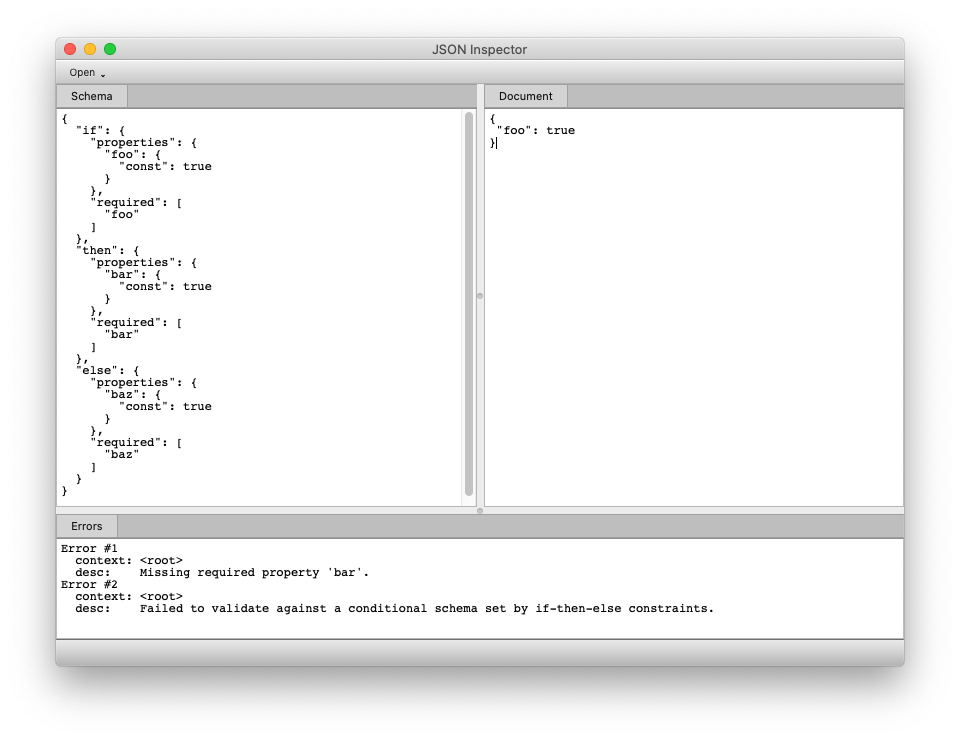
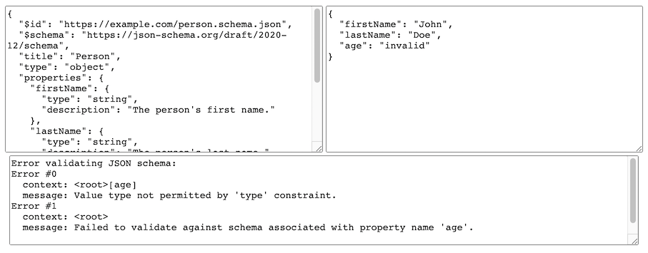

# Valijson

Valijson is a header-only [JSON Schema](http://json-schema.org/) validation library for _Modern C++_.

Valijson provides a simple validation API that allows you to load JSON Schemas, and validate documents loaded by one of several supported parser libraries. A compiler with full C++17 support is required.

## Project Goals

The goal of this project is to support validation of all constraints available in JSON Schema v7, while being competitive with the performance of a hand-written schema validator.

## Version Compatibility

Valijson is currently maintained across three active minor versions. The key difference between each version is the underlying C++ standard that each targets. The legacy `v1.0.x` series remains compatible with C++14, while the `v1.1.x` series adopts C++17, and the upcoming `v1.2.x` line will move to C++20.

| Version  | C++ Standard | Notes                         | Branch
|----------|--------------|-------------------------------|--------
| v1.0.x   | C++14        | Legacy release line.          | [v1.0.x](https://github.com/tristanpenman/valijson/tree/v1.0.x)
| v1.1.x   | C++17        | Current C++17-focused series. | [master](https://github.com/tristanpenman/valijson/tree/master)
| v1.2.x   | C++20        | Planned C++20-ready version.  | [v1.2.x](https://github.com/tristanpenman/valijson/tree/v1.2.x)

The [master](https://github.com/tristanpenman/valijson/tree/master) branch on GitHub currently tracks the v1.1.x series.

Code written for Valijson `v1.0.x` that already compiles in a C++14 environment should continue to build with minimal adjustments when moving to v1.1 and C++17.

## Usage

Clone the repo, including submodules:

```bash
git clone --recurse-submodules git@github.com:tristanpenman/valijson.git
```

The following code snippets show how you might implement a simple validator using RapidJSON as the underlying JSON parser.

Include the necessary headers:

```cpp
#include <valijson/adapters/rapidjson_adapter.hpp>
#include <valijson/utils/rapidjson_utils.hpp>
#include <valijson/schema.hpp>
#include <valijson/schema_parser.hpp>
#include <valijson/validator.hpp>
```

These are the classes that we'll be using:

```cpp
using valijson::Schema;
using valijson::SchemaParser;
using valijson::Validator;
using valijson::adapters::RapidJsonAdapter;
```

We are going to use RapidJSON to load the schema and the target document:

```cpp
// Load JSON document using RapidJSON with Valijson helper function
rapidjson::Document mySchemaDoc;
if (!valijson::utils::loadDocument("mySchema.json", mySchemaDoc)) {
    throw std::runtime_error("Failed to load schema document");
}

// Parse JSON schema content using valijson
Schema mySchema;
SchemaParser parser;
RapidJsonAdapter mySchemaAdapter(mySchemaDoc);
parser.populateSchema(mySchemaAdapter, mySchema);
```

Load a document to validate:

```cpp
rapidjson::Document myTargetDoc;
if (!valijson::utils::loadDocument("myTarget.json", myTargetDoc)) {
    throw std::runtime_error("Failed to load target document");
}
```


Validate a document:

```cpp
Validator validator;
RapidJsonAdapter myTargetAdapter(myTargetDoc);
if (!validator.validate(mySchema, myTargetAdapter, nullptr)) {
    throw std::runtime_error("Validation failed.");
}
```

Note that Valijson's schema parsing and validation APIs expect you to pass in a `RapidJsonAdapter` rather than a `rapidjson::Document`. `SchemaParser::populateSchema()` and `Validator::validate()` accept adapter types for any of the JSON representations supported by Valijson.

### Exceptions

When Valijson is included in a project as a CMake target, exceptions are enabled by default through the `valijson_USE_EXCEPTIONS` option. Set this option to `OFF` to disable exception throwing in Valijson. The resulting `VALIJSON_USE_EXCEPTIONS` compile definition is propagated to targets that link against Valijson.

When using the headers without the CMake target, define `VALIJSON_USE_EXCEPTIONS=1` before including Valijson headers to enable exceptions. If the macro is not defined, fatal Valijson errors are reported to standard error before the process is aborted.

### Strong vs Weak Types

Valijson has a notion of strong and weak typing. By default, strong typing is used. For example, the following will create a validator that uses strong typing:

```cpp
Validator validator;
```

This is equivalent to:

```cpp
Validator validator(Validator::kStrongTypes);
```

This validator will not attempt to cast between types to satisfy a schema. So the string `"23"` will not be parsed as a number.

Alternatively, weak typing can be used:

```cpp
Validator validator(Validator::kWeakTypes);
```

This will create a validator that will attempt to cast values to satisfy a schema. The original motivation for this was to support the Boost Property Tree library, which can parse JSON, but stores values as strings.

### Strict vs Permissive Date/Time Formats

JSON Schema supports validation of certain types using the `format` keyword. Supported formats include `time`, `date`, and `date-time`. When `date-time` is used, the input is validated according to [RFC 3339](./doc/specifications/rfc3339-timestamps.txt). By default, RFC 3339 requires that all date/time strings are unambiguous - i.e. are defined in terms of a local time zone. This is controlled by the `Z` suffix (for UTC) or a `+01:00` style modifier.

Valijson can be configured to allow ambiguous date/time strings.

```cpp
Validator validator(Validator::kStrongTypes, Validator::kPermissiveDateTime);
```

The default is strict date/time validation, which is equivalent to:

```cpp
Validator validator(Validator::kStrongTypes, Validator::kStrictDateTime);
```

## Regular Expression Engine

When enforcing a 'pattern' property, a regular expression engine is used. By default, the default regular expression (`DefaultRegexEngine`) uses `std::regex`.
Unfortunately, `std::regex` has no protection against catastrophic backtracking and the implementation in gcc is so suboptimal that it can easily lead to segmentation faults.

This behaviour can be customised by implementing a wrapper for alternative regular expression engine.

To do this, you must implement the following interface:

```cpp
struct MyRegexpEngine
{
    MyRegexpEngine(const std::string& pattern)
    {
        // implementation specific
    }

    static bool search(const std::string& s, const MyRegexpEngine& r)
    {
        // implementation specific
    }
};
```

Then to use it, you must define a custom validator type:

```cpp
    using MyValidator = ValidatorT<MyRegexpEngine>;
```

Once you've done this, `MyValidator` can be used in place of the default `valijson::Validator` type.

Alternatively the library can be instructed to use `boost::regex` by specifying either `valijson_USE_BOOST_REGEX=TRUE` in CMake or defining `VALIJSON_USE_BOOST_REGEX=1` before including any Valijson headers. Valijson does not provide Boost.Regex, so it must already be available to the build.

## Memory Management

Valijson has been designed to safely manage, and eventually free, the memory that is allocated while parsing a schema or validating a document. When working with an externally loaded schema (i.e. one that is populated using the `SchemaParser` class) you can rely on RAII semantics.

Things get more interesting when you build a schema using custom code, as illustrated in the following snippet. This code demonstrates how you would create a schema to verify that the value of a 'description' property (if present) is always a string:

```cpp
{
    // Root schema object that manages memory allocated for
    // constraints or sub-schemas
    Schema schema;

    // Allocating memory for a sub-schema returns a const pointer
    // which allows inspection but not mutation. This memory will be
    // freed only when the root schema goes out of scope
    const Subschema *subschema = schema.createSubschema();

    {   // Limited scope, for example purposes

        // Construct a constraint on the stack
        TypeConstraint typeConstraint;
        typeConstraint.addNamedType(TypeConstraint::kString);

        // Constraints are added to a sub-schema via the root schema,
        // which will make a copy of the constraint
        schema.addConstraintToSubschema(typeConstraint, subschema);

        // Constraint on the stack goes out of scope, but the copy
        // held by the root schema continues to exist
    }

    // Include subschema in properties constraint
    PropertiesConstraint propertiesConstraint;
    propertiesConstraint.addPropertySubschema("description", subschema);

    // Add the properties constraint
    schema.addConstraint(propertiesConstraint);

    // Root schema goes out of scope and all allocated memory is freed
}
```

## JSON References

The library includes support for local JSON References. Remote JSON References are supported only when the appropriate callback functions are provided.

Valijson's JSON Reference implementation requires that two callback functions are required. The first is expected to return a pointer to a newly fetched document. Valijson takes ownership of this pointer. The second callback function is used to release ownership of that pointer back to the application. Typically, this would immediately free the memory that was allocated for the document.

## Test Suite

Valijson's test suite currently contains several hand-crafted tests and uses the standard [JSON Schema Test Suite](https://github.com/json-schema/JSON-Schema-Test-Suite) to test support for parts of the JSON Schema feature set that have been implemented.

### CMake

The examples and test suite can be built using CMake:

```bash
# Build examples and test suite
mkdir build
cd build
cmake .. -Dvalijson_BUILD_TESTS=ON -Dvalijson_BUILD_EXAMPLES=ON
make

# Run test suite (from build directory)
./test_suite
```

## How to add this library to your CMake target

Valijson can be integrated either as git submodule or with `find_package()`.

### Valijson with CMake's FetchContent

If you consume Valijson via `FetchContent`, you can avoid fetching Git submodules by setting `GIT_SUBMODULES` to an empty list. You will also need to keep tests and examples disabled.

This is typically what you want for header-only usage:

```cmake
include(FetchContent)

FetchContent_Declare(
  valijson
  GIT_REPOSITORY https://github.com/tristanpenman/valijson.git
  GIT_TAG v1.1.2
  GIT_SHALLOW TRUE
  GIT_SUBMODULES ""
)

set(valijson_BUILD_TESTS OFF CACHE BOOL "Don't build valijson tests" FORCE)
set(valijson_BUILD_EXAMPLES OFF CACHE BOOL "Don't build valijson examples" FORCE)

FetchContent_MakeAvailable(valijson)

target_link_libraries(your-executable PRIVATE ValiJSON::valijson)
```

Including `GIT_SUBMODULES ""` keeps CMake from initializing the third-party Git submodules. These are only required for building examples and the test suite.

### Valijson as git submodule

Download this repository into your project

```bash
git clone --recurse-submodules https://github.com/tristanpenman/valijson <project-path>/third-party/valijson
```

If your project is a git repository

```bash
cd <project-path>
git submodule add https://github.com/tristanpenman/valijson third-party/valijson
```

Before the target add the module subdirectory in your CMakeLists.txt

```cmake
set(valijson_BUILD_TESTS OFF CACHE BOOL "Don't build valijson tests" FORCE)
set(valijson_BUILD_EXAMPLES OFF CACHE BOOL "Don't build valijson examples" FORCE)
add_subdirectory(third-party/valijson)

add_executable(your-executable ...)

target_link_libraries(your-executable ValiJSON::valijson)
```
### Install Valijson and import it

It is possible to install headers by running CMake's install command from the build tree. Once Valijson is installed, use it from other CMake projects using `find_package(valijson)` in your CMakeLists.txt.

```bash
# Install Valijson
git clone --recurse-submodules --depth=1 git@github.com:tristanpenman/valijson.git
cd valijson
mkdir build
cd build
cmake ..
cmake --install .
```

```cmake
# Import installed valijson and link it to your executable
find_package(valijson REQUIRED)
add_executable(executable main.cpp)
target_link_libraries(executable valijson)
```

## Bundled Headers

An alternative way to include Valijson in your project is to generate a bundled header file, containing support for just one parser/adapter.

You can generate a header file using the `bundle.sh` script:

```bash
./bundle.sh nlohmann_json > valijson_nlohmann_bundled.hpp
```

This can then be used in your project with a single `#include`:

```cpp
#include "valijson_nlohmann_bundled.hpp"
```

An example can be found in [examples/valijson\_nlohmann\_bundled\_test.cpp](examples/valijson_nlohmann_bundled_test.cpp).


## Examples

Building with `valijson_BUILD_EXAMPLES=ON` compiles the examples in the [examples](examples) directory, including `custom_schema`, `external_schema`, adapter iteration examples, JSON Pointer and remote-reference examples, and `valijson_benchmark`. The `remote_resolution_url` example is built when curlpp is available.

`custom_schema` shows how you can hard-code a schema definition into an application, while `external_schema` builds on the example code above to show you how to validate a document and report any validation errors.

## Benchmarking

The examples include a benchmarking program (`valijson_benchmark`), which uses [Nlohmann JSON](https://github.com/nlohmann/json) as the underlying parser. Swapping out alternative parsers for your own testing is relatively straight-forward.

Running `valijson_benchmark` with no arguments, will print out usage instructions:

```
Usage: ./valijson_benchmark <iterations> <schema> <document|directory> [document|directory]...
```

* The first argument is the number of iterations to run.
* The second argument is a schema to load for benchmarking.
* All subsequent arguments are paths to JSON documents, or directories containing JSON documents.

A sample schema and a pair of test documents can be found in [etc](etc).

```
mkdir -p build
cd build
cmake .. -Dvalijson_BUILD_EXAMPLES=1
make valijson_benchmark
./valijson_benchmark 1000000 ../etc/hello-world.schema.json ../etc/hello-world.document.*
```

The output should look something like this (results from a MacBook Air M3):
```
Validated 2000000 documents in 6.63379 seconds.
Documents: 2, Iterations: 1000000 (301487 per second)
1000000 validation failure(s) encountered.
```

## JSON Schema Support

Valijson supports the validation keywords defined in [JSON Schema Draft 7](https://json-schema.org/draft-07/json-schema-release-notes.html), as exercised by the standard JSON Schema Test Suite.

The `default` keyword is annotation-only and does not affect validation. Valijson validates the `date`, `time`, `date-time`, and `ipv4` formats; other formats are not currently enforced.

Local JSON References are supported. Remote references are supported when document-fetch and document-release callbacks are supplied to `SchemaParser::populateSchema()`.

## JSON Inspector

An example application based on Qt is also included under [inspector](./inspector). It can be used to experiment with JSON Schemas and target documents. JSON Inspector is a self-contained CMake project, so it must be built separately:

```bash
cd inspector
mkdir build
cd build
cmake ..
make
```

Schemas and target documents can be loaded from file or entered manually. Content is parsed dynamically, so you get rapid feedback.

Here is a screenshot of JSON Inspector in action:



## Live Demo

A [web-based demo is available](https://letmaik.github.io/valijson-wasm), courtesy of [Maik Riechert](https://github.com/letmaik).

This demo uses Emscripten to compile Valijson and [Nlohmann JSON](https://github.com/nlohmann/json) (JSON for Modern C++) to WebAssembly. The source code can be found in [letmaik/valijson-wasm](https://github.com/letmaik/valijson-wasm) and is available under the MIT license.



## Documentation

Doxygen documentation can be built by running 'doxygen' from the project root directory. Generated documentation will be placed in 'doc/html'. Other relevant documentation such as schemas and specifications have been included in the 'doc' directory.

## Dependencies

Valijson requires a compiler with full C++17 support.

When building the test suite, Boost 1.54, Qt 5 or Qt 6, and Poco are optional dependencies.

## Supported Parsers

Valijson supports JSON documents loaded using various JSON parser libraries. The list below gives the bundled version where a dependency is included as a submodule, or a supported baseline for dependencies that must be installed separately:

 - [boost::property\_tree 1.54](http://www.boost.org/doc/libs/1_54_0/doc/html/boost_propertytree/synopsis.html)
 - [Boost.JSON 1.75](https://www.boost.org/doc/libs/1_75_0/libs/json/doc/html/index.html)
 - [json11 (commit 2df9473)](https://github.com/dropbox/json11/tree/2df9473fb3605980db55ecddf34392a2e832ad35)
 - [jsoncpp 1.9.5](https://github.com/open-source-parsers/jsoncpp/releases/tag/1.9.5)
 - [nlohmann/json 3.1.2](https://github.com/nlohmann/json/releases/tag/v3.1.2)
 - [RapidJSON (commit 06d58b9)](https://github.com/Tencent/rapidjson/tree/06d58b9e848c650114556a23294d0b6440078c61)
 - [PicoJSON (commit 9dfda04)](https://github.com/kazuho/picojson/tree/9dfda04e89c28a9e602ce9ef626dd9b6acbc6e60)
 - [yaml-cpp (commit 2decf96)](https://github.com/jbeder/yaml-cpp/tree/2decf96e915d2b0c26c68c1659665789dfef2633)
 - [Poco JSON 1.14.0](https://pocoproject.org/docs/Poco.JSON.html)
 - [Qt 5.8](http://doc.qt.io/qt-5/json.html) or [Qt 6](https://doc.qt.io/qt-6/json.html), with the version-specific support described below

Other versions of these libraries may work, but have not been tested. In particular, versions of jsoncpp going back to 0.5.0 should also work correctly.

When compiling with older versions of Boost (< 1.76.0) you may see compiler warnings from the `boost::property_tree` headers. This has been addressed in version 1.76.0 of Boost.

### Qt Support

Valijson provides two adapters for Qt Core types:

| Qt version | `QtJsonAdapter` (`QJsonValue`) | `QtVariantAdapter` (`QVariant`) |
|------------|--------------------------------|---------------------------------|
| Qt 5       | Supported                      | Not supported                   |
| Qt 6       | Supported                      | Supported                       |

`QtJsonAdapter`, provided by `<valijson/adapters/qtjson_adapter.hpp>`, validates values represented by Qt's JSON classes and is available with both Qt 5 and Qt 6.

`QtVariantAdapter`, provided by `<valijson/adapters/qvariant_adapter.hpp>`, validates JSON-compatible `QVariant` values and is available with Qt 6 only. JSON arrays and objects must be represented by `QVariantList` and `QVariantMap`, respectively. The corresponding `<valijson/utils/qvariant_utils.hpp>` helper loads a JSON document into a `QVariant` using `QJsonDocument::toVariant()`.

When the test suite is configured with Qt 5, only the `QtJsonAdapter` tests are built. With Qt 6, tests for both Qt adapters are built.

## Package Managers

If you are using [vcpkg](https://github.com/Microsoft/vcpkg) on your project for external dependencies, then you can use the [valijson](https://github.com/microsoft/vcpkg/tree/master/ports/valijson) package. Please see the vcpkg project for any issues regarding the packaging.

You can also use [conan](https://conan.io/) as a package manager to handle [valijson](https://conan.io/center/valijson/0.3/) package. Please see the [conan recipe](https://github.com/conan-io/conan-center-index/tree/master/recipes/valijson) for any issues regarding the packaging via conan.

## Test Suite Requirements

Supported versions of these libraries have been included in the 'thirdparty' directory so as to support Valijson's examples and test suite.

The exceptions to this are boost, Poco and Qt, which due to their size must be installed to a location that CMake can find.

## Known Issues

When using PicoJSON, it may be necessary to include the `picojson.h` before other headers to ensure that the appropriate macros have been enabled.

When building Valijson using CMake on macOS, with Qt installed via Homebrew, you may need to set `CMAKE_PREFIX_PATH` so that CMake can find your Qt installation, e.g:

```bash
mkdir build
cd build
cmake .. -DCMAKE_PREFIX_PATH=$(brew --prefix qt@6)
make
```

## License

Valijson is licensed under the Simplified BSD License.

See the LICENSE file for more information.
